# Kaptain Holiday
### HTML and CSS Essentials Portfolio Project 1
Site link : https://roeszler.github.io/kapthol/index.html

## 1. Purpose of the Project

Kaptain Holiday is a site that represents a theoretical business that facilitates holidays for small to medium businesses. The site is targeted at three main users looking to employ/provide services that allow them to take a break from the daily operations of their small business:

- __Business owner / managers__ looking for someone to take over the daily operations of their business for a short time (_The 'Clients'_).

- __Business professionals__ with appropriate training, responsibility and availability to care-take operations within a small to medium business for a contract period of time (_The 'Providers'_).

- __Business Students__ looking to gain small business management experience in an assistant manager role for a short period of time, across a variety of industries and global locations (_The 'Assistants'_).

Based out of Stockholm, Sweden, __Kaptain Holiday__ will be useful for those looking for work flexibility, experiences, travel and/or comfortably coordinating their business operations while they take a break.

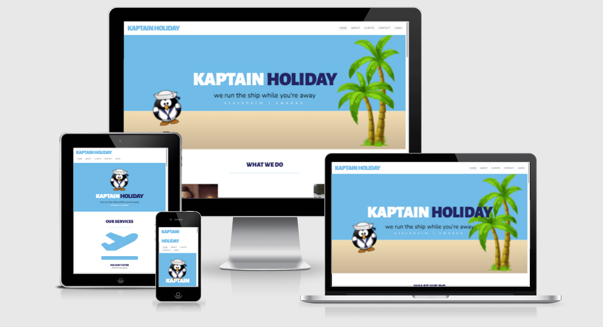

### Main Products / Services

| 3 x Primary Services | | 3 x Working Formats |
| - |:-:| -:|
| 1. Holiday Cover | | Assistant to Manager (testing) .A|
| 2. Management Experience | | Proxy Manager (holidays) .B|
| 3. Service Trial | | Management Exchange (business swaps) .C|

## Note : User Centered Design 

Considering the importance of user experience (UX) and user centered design (UCD) in all web / app developments, and to better develop my understanding, I have spent a portion of my time to include a mock-up of the research and information that may be gleaned from such a process. 

I gave attention to this process in the knowledge that this will be an invaluable tool as I progress in my studies and working life. 

Below are links to the markdown documents I have created to assist my understanding of the development design processes as it would relate to a live project. 

The mockup documents will be referred to as required within the text and/or you can be accessed them all here:

1. [Strategy Plane](docs/ucd/1-strategy.md) (working example)
2. [Sope Plane](docs/ucd/2-scope.md) (framework only)
3. [Structure Plane](docs/ucd/3-structure.md) (framework only)
4. [Skeleton Plane](docs/ucd/4-skeleton.md) (framework only)
5. [Surface Plane](docs/ucd/5-surface.md) (framework only)

## 2. User Stories

A working document of sample user stories can be found [here](docs/ucd/stories.md). The following stories have been arranged in accordance to the sections they are seen in this project.

__Entire Site__
- As a site user I can see that all pages are responsive to different devices being used so I can have a responsive experience across devices used to view it.
- As a viewer of the code I can see that each .html page uses a remotely accessed CSS format so I can confirm this section follows appropriate ease of styling and semantic code structuring practices.
- As a site user I can see that every non-text element has alt text so that the website can meet accessibility guidelines.

- Header
  - As a viewer of code: 
    - I can see the index.html page has a < header > element with corresponding id="header"
    - I can see an image within the header element with a corresponding id="header-img"
    - I can see that within the < header > element there is a < nav > element with corresponding id="nav-bar"
  - So that code viewers can confirm this section follows appropriate semantic code structuring practices.
  - As a site user I can see the layout of the < header > element is always at the top of the viewport so that navigation is easy and intuitive.

- Home Button / Icon
  - As a site user I can easily identify with the style and location of the home button in the nav bar or the left header text so as to intuitively navigate the sections and pages of the site.

- Nav Bar
  - As a site user I can click any given .nav-link button in the nav bar so that I am taken to the corresponding section of the index.html and/or login.html pages.

__Home Page__

- Hero Text
  - As a site user I can see that the hero text on the #home section is clearly presented, appropriately colored and contrasted so that the site is introduced intuitively in an easy to read manner.

- Hero Image
  - As a site user I can identify with the hero image to relate to the core services of the business so that business value proposition can be reinforced during my time navigating the site.

- Layout
  - As an initial site user I can see the top of the subsequent page bleeding up at the bottom of the page so that I am enticed to investigate the site further.

__Gallery (Our Clients)__
- Accessed through further investigation into the holiday service as a business owner, as a user of the site I can view the experiences of past clients of the business so I can better understand the experience of using these services.
- As a potential customer of the business I can further investigate the experience of other customers so I can decide if it will work with my situation and needs.
- As a business stakeholder I can present more detailed information to potential clients so I can convert them into long term paying customers.

__Contact Us__
- Form
  - As a viewer of the code I can see that the index.html page has a < form > element with a corresponding id="form" so I can confirm this section follows appropriate semantic code structuring practices.
  - As a viewer of the code I can see that within the form, there is an < input > field with id="email" so I can enter an email address.
  - As a viewer of the code I can see that the #email input field should have a label or placeholder text so that the user knows what the field is for.
  - As a viewer of the code I can see that #email input field uses HTML5 validation so that we can confirm that the entered text is an email address.
  - As a viewer of the code I can see that within the form, there is a submit < input > with corresponding id="submit" to allow ease of CSS styling in the future.
  - As a site user I can click the #submit button so that the email is submitted to a static thank-you for submission page (success.html) that confirms the email address was entered (and that it posted successfully).

- Map 
  - As a site user I can see an embedded google map of our head office at the immediate end of the contact us section to convey a sense of permanency in the business operations.

- Footer
  - As a site user I can see a footer section containing links to our pages' popular social media sites so I can interact with friends and follow updates from the business page. 

## 3. Features 

### 3.1 Existing Features

- __Head & Meta Terms__
  - Nomenclature
    - Discussed further in the [strategy.md](docs/ucd/1-strategy.md) documentation, Kaptain Holiday name was selected for its memorable nature, sense of playfulness and meaningful connection to the core value proposition of the business.
    - Key Terms : kaptain, holiday, holidays, captain holiday, management, proxy, stand-in, locum, business holiday, Sweden, Stockholm, facilitator, small business management.

  - Content
    - Each .html page uses a remotely accessed CSS format so that code editors can more easily change the format of content from the one location

  - Layout 
    - All pages have at least one media query to make the viewport responsive to different popular devices. This is so users can have a responsive experience across devices used to view the entire site.

<br>

__Navigation Bar__


  - Is featured identically on all pages in the top right hand corner with a minimal design to create a clean simple style and allow easy intuitive navigation. 
  - The full responsive navigation bar includes links to the home page, our services, customer stories, login / registration and contact us pages to allow easy intuitive navigation.
  - The site is designed to be browsed easily as a single page site with additional 'deeper' pages used to delve into more detail as required by the B2B user.
  - The navigation bar allows the user to easily navigate from page to page across all devices without having to revert back to the previous page via the ‘back’ button.


__The Landing Page & Image__

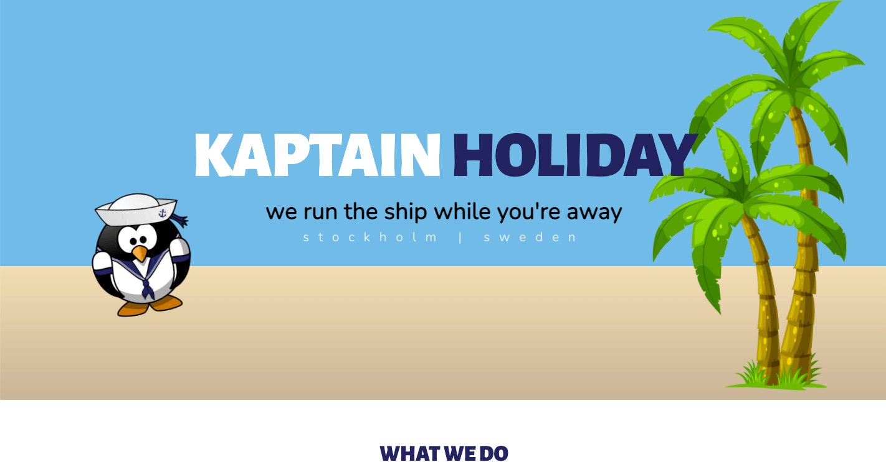

  - The landing section includes a format and images with text overlay to allow the user to understand what type of user this site would be applicable to.
  - The landing section announces the core business proposition with a subtle growth and rotation animation to grab the users attention toward the site mascot image ([Sailor Penguin](assets/images/kapthol-hero-image.webp)).

__The Header__


  - The header shows the name of the business, using the corporate colors selected from the corporate color scheme discussed further in the [strategy.md](docs/ucd/1-strategy.md) documents attached.
  - It has been styled to stick to the top of the viewing window as the user scrolls down each page with a 85% opacity to enhance the modern professional feel of the site.


__About Us Section__

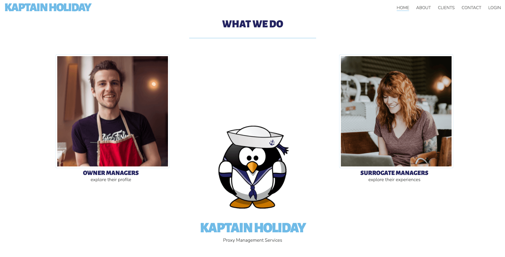
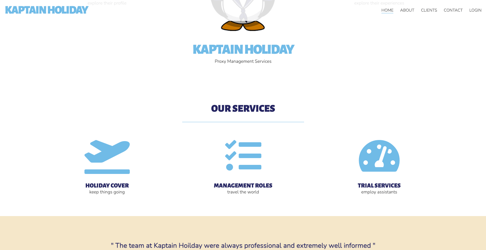

  - Allow the user to see the typical process of the Kaptain Holiday product delivery in a visual format to better understand the services of the business.
  - Allow the user to see the value of kaptain holiday to allow them to take a break. 
  - Allow the user their first chance to select / investigate which product option that may suit their particular circumstances.
  - Allow users to initiate a contact us call to action so they may start using kaptain holiday services. 

__Gallery (our clients) section__

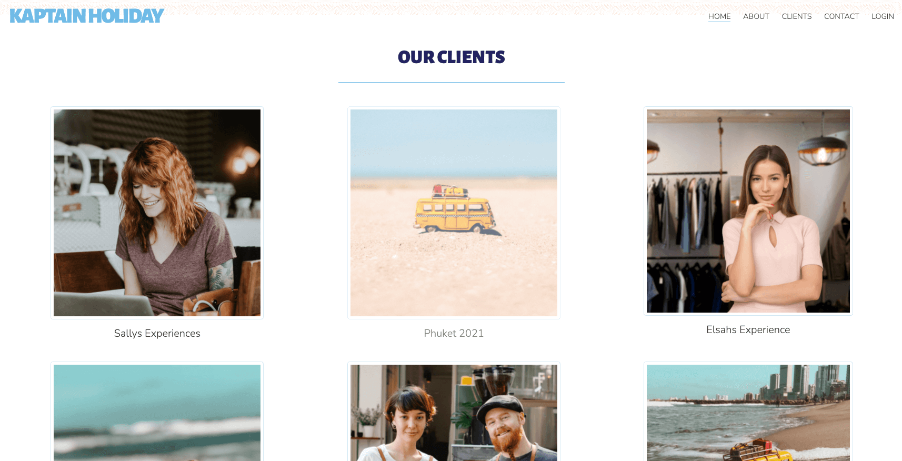

  - This section allows the user to further explore the product range and experiences of model customers. It is aimed to encourage users to consider Kaptain holiday as part of their next planned break away from their business. 
  - This section will be kept up to date as times and new initiatives become available to keep the user engaged with the business. 

__The Contact Us Section__

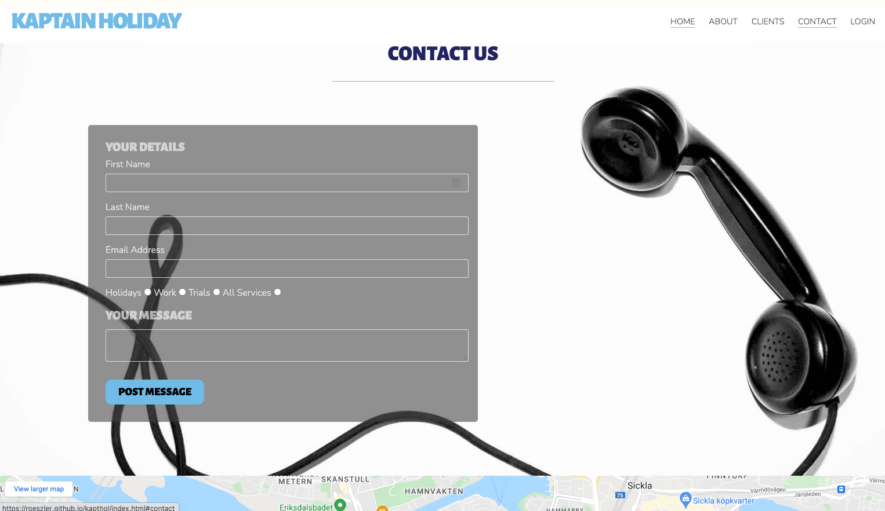

  - This section will allow the user to contact Kaptain Holiday with queries
  - The user will be able to specify if they would like to take part in hiring a manager, manager exchange exchange programs, or applying to become a manager with Kaptain Holiday. 
  - The user will be asked to submit their full name, email address (required) and a small enquiry message.

__The Footer__ 

  - The footer section includes links to the relevant social media sites for Kaptain Holiday. The links will open to a new tab to allow easy navigation for the user. 
  - The footer section includes information for the user on the legal format and registered office address of the Kaptain Holiday business. 
  - The footer is valuable to the user as it encourages them to keep connected via social media and share with people / businesses they may know that may use the kaptain holiday service(s).
  - On the contact section of the index.html page only, there is a map immediately preceding the form to promote a sense of business location and permanency should users wish to investigate further.

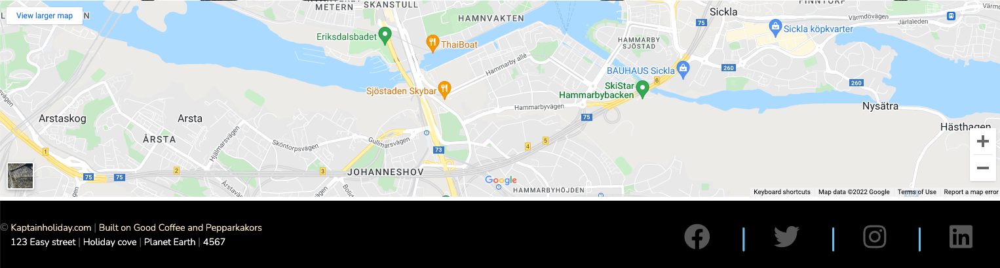

### Subsequent HTML Pages

__Gallery / User Case Studies Pages__

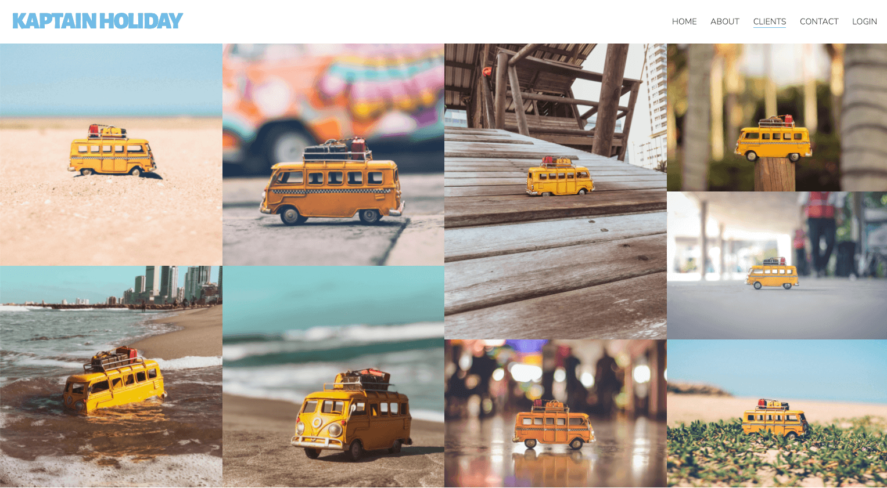
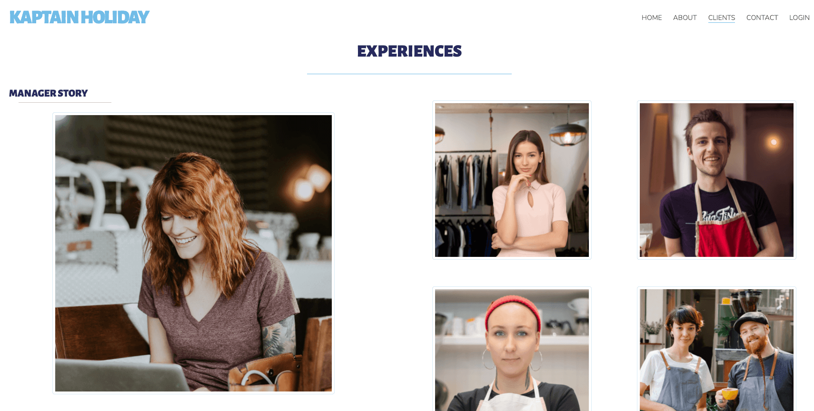

  - The experience and client pages are designed to be the base format of three main product options (business holidays, working flexibility and testing services with assistant managers)> The pages are designed to allow the user to investigate further which option is valuable to their situation. 
  - This page provides the user with supporting images and information to see what types of professionals are available to manage their business while they are away. 
  - These pages are valuable to the user as they will be able to relate to the requirements and types of businesses and professionals that Kaptain Holiday typically helps.

__The Register / Login Page__

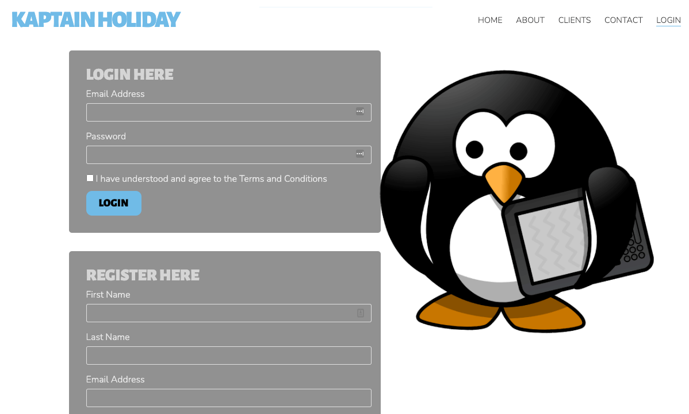

  - This page will allow the user to either login or sign up to Kaptain Holiday to start planning their next holiday within the community. 
  - The user will be able to specify if they would like to take part in hiring a manager, manager exchange exchange programs, or applying to become a manager with us. 
  - The user will be asked to submit their full name, email address and LinkedIn details. 

__Successful Submission Page__

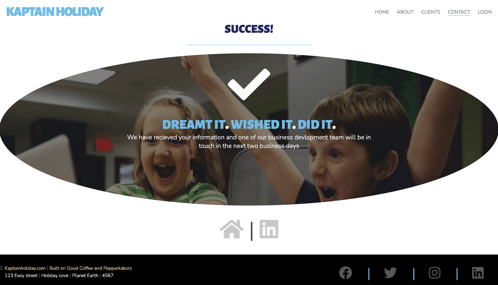

  - This page is displayed to the user following a successful enquiry submission and indicates a call to action to refer friends via social media and/or return to the site homepage.
  - The success image is a slight deviation away from the site's penguin logo, however the light, fun feel of the action of the site is maintained.

### 3.2 Future Features
___
  - Underline in the nav header on active status on a single page. An example of this is the 'contact us' (```/index.html#contact```) selection. It should make the contact lettering in the menu become underlined in the nav bar when the 'contact us section' is being viewed. 
    - As a majority of the navigation elements are designed to link to id's on the same page (ie function as a "single page site"), a future feature is to use some form of JavaScript / JQuery to make the relative navbar section appear active on page id selection. This will likely involve the use of an element like : ```window.location.href```.

  - Include a description of the exchange process in more visual detail
  - Hamburger icon for menu navigation on mobile devices
  - Functional database, interaction and account page for logged-in users
  - Popup Q&A animations 
  - Automated connecting of current registered [clients](ucd/1-strategy.md) and [providers](ucd/1-strategy.md)
  - Possible membership on a subscription model basis
  - API links into CRM and project management software (like [jira](https://www.atlassian.com/software/jira), [trello](https://trello.com/), [hubspot](https://www.hubspot.com/) and/or [slack](https://slack.com/))
  - Intuitive tracking and cataloging of content
  - Further entry animation and smoothing
  - Synergy with ongoing content from small-business education providers 

<br>

## 4. Typography and color scheme

__Typography__

Typography was evaluated in line with the themes and brand aiming for a the non-corporate nature of business owner / managers.
  - Bold main 
  - Smooth easy to read content 
  - Excellent contrast 
  - Adequately portray the light, summer holiday feel for the site
  
Selection process :
  - Review of similar and complementary fonts from variety of internet based sources
  - Selection of those that seem appropriate to the business profile summarized in the [strategy.md](docs/ucd/1-strategy.md) process.
    - Shortlist of fonts:
      - Anton / Roboto
      - Alfa Slab / Open Sans
      - Alegreya Sans / Roboto
      - Lobster / Open Sans
      - Quicksand / Ubentu
      - Nunito / Roboto
      - Oswald / Nunito 
  
  On evaluation of the look, feel, and summer time feel sought for the project, a combination of [Alegreya Sans](https://fonts.google.com/specimen/Alegreya+Sans) / [Nunito](https://fonts.google.com/specimen/Nunito) was chosen. 
    

__Color Scheme__ 

  | Primary Color Palette | Hexadecimal Value | RGBA Value  |
  | - |:-:| -:|
  | Sky Blue | #3AADFB | rgba(58,173,251, 1) |
  | Sailor Blue | #232361 | rgba(35,35,97, 1) |
  | Light Tan | #F2DDB2 | rgba(242,221,178,1) |
  | Red | #FF0000 | rgba(253,0,0,1) |
  | White | #FFFFFF | rgba(255,255,255,1) |
  | Black | #000000 | rgba(0,0,0,1) |
  | Gray | #3a3a3a | rgba(58,58,58,1) |

  In a effort to maintain build consistency, I have converted all rgba values to thier equivalent HEXA values using the below conversion table :


| Opacity % | RGB-A	| HEX-A Code |
| :-: | -: | :-: |
| 100 | 1 | FF
| 99	| 0.99 | FC
| 98 | 0.98 |	FA
| 97 | 0.97 | F7
| 96 | 0.96 |	F5
95 | 0.95	| F2
94 | 0.94 | F0
93 | 0.93	| ED
92 | 0.92 | EB
91 | 0.91	| E8
90 | 0.9	| E6
89 | 0.89 | E3
88 | 0.88	| E0
87 | 0.87	| DE
86 | 0.86	| DB
85 | 0.85 | D9
84 | 0.84	| D6
83 | 0.83	| D4
82 | 0.82 | D1
81 | 0.81	| CF
80 | 0.8  | CC
79 | 0.79 | C9
78 | 0.78	| C7
77 | 0.77 | C4
76 | 0.76	| C2
75 | 0.75 | BF
74 | 0.74	| BD
73 | 0.73	| BA
72 | 0.72	| B8
71 | 0.71	| B5
70 | 0.7 | B3
69 | 	| B0
68 | 	| AD
67 | 	| AB
66 |	| A8
65 |	| A6
64 |	| A3
63 |	| A1
62 |	| 9E
61 |	| 9C
60 | 0.6 | 99
59 |	| 96
58 |	| 94
57 |	| 91
56 |	| 8F
55 |	| 8C
54 |	| 8A
53 |	| 87
52 |	| 85
51 |	| 82
50 | 0.5 | 80
49 |	| 7D
48 |	| 7A
47 |	| 78
46 |	| 75
45 |	| 73
44 |  | 70
43 |	| 6E
42 |	| 6B
41 |	| 69
40 | 0.4 | 66
39 |	| 63
38 |	| 61
37 |	| 5E
36 |	| 5C
35 |	| 59
34 |	| 57
33 |	| 54
32 |	| 52
31 |	| 4F
30 | 0.3 | 4D
29 | 0.29 | 4A
28 |	| 47
27 |	| 45
26 |	| 42
25 |	| 40
24 |	| 3D
23 |	| 3B
22 |	| 38
21 |	| 36
20 | 0.2 | 33
19 |	| 30
18 |	| 2E
17 |	| 2B
16 |	| 29
15 |	| 26
14 |	| 24
13 |	| 21
12 |	| 1F
11 |	| 1C
10 | 0.1 | 1A
9  | 0.09 | 17
8	 | 0.08 | 14
7	 | 0.07 | 12
6	 | 0.06 | 0F
5	 | 0.05 | 0D
4	 | 0.04 | 0A
3	 | 0.03 | 08
2	 | 0.02 | 05
1	 | 0.01 | 03
0	 | 0 | 00

The above color combinations (and opacity variations) were chosen based partly on :
  - The summer feel sought for the site 
  - Access to the hero image 'penguin' discovered at Pixbay user [OpenClipart-Vectors](https://pixabay.com/vectors/tux-anchor-animal-bird-boat-ferry-161379/).

__Branding__

The themes and branding associated with Kaptain Holiday is aimed at associating a :
  - Light, happy, sunny, cloud free, blue skies, impact, fun - non-corporate nature of business owner / managers.
  - Services and solutions aim to be subtly associated with a "day at the beach" or "a sunny holiday with a pool". 
  - The demographic is aimed at the mid twenties (providers / assistants) to late forties (clients) age groups. 
    
## Supported Screens and Browsers
Testing was performed on a mix of when the display element changed and the resolution of screen sizes currently popular in europe and the UK.
### Screen Sizes 
- Desktops
  - .
- Mobiles
  - . 
- Tablets
  - .
### Browsers 
- Chrome devlopment environment
- MS Edge 
- Safari 

A simple visualization of the layout and coloring intended for the site, it conveys the to the user as they experience the site. The feel and function of the site is intended to be light, summary with an air of simple effective service delivery. 

The media sizes employed in the wireframes, that will eventually be intended for the responsive transitions seen on the site, have been based on future popular sizes seen in the UK. This information has been sourced from [https://gbksoft.com/](https://gbksoft.com/blog/common-screen-sizes-for-responsive-web-design/).

Gbksoft also indicates the typical use of media used to browse web pages is predominantly mobile, seen in the table below : 

| Desktop vs. mobile vs tablet worldwide ||
| - | -:|
| Mobile | 55.73% |
| Desktop | 41.46% |
| Tablet | 2.81% |

Acknowledging the scope of the project and beginner nature of my skills as a coder in html / css, I originally considered starting the design with a mobile interface and scaling it up with media queries to a desktop version.

With my focus to learn the process of html / css design, and the innate relative simplicity of mobile sites, I found it easier to focus on a desktop version initially, then simplifying it into a mobile interface using media queries.

__The Landing Sections__ 

Desktop 


Tablet

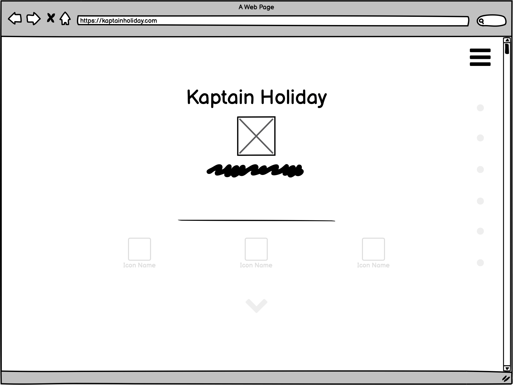

Mobile

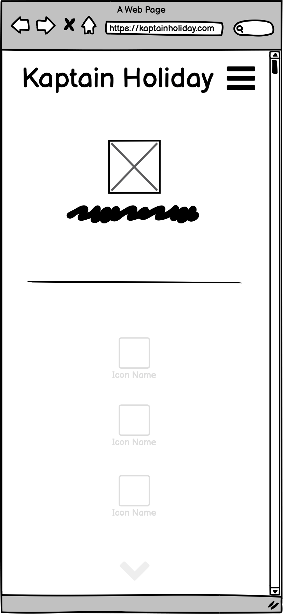

__What We Do (About Us)__


Desktop
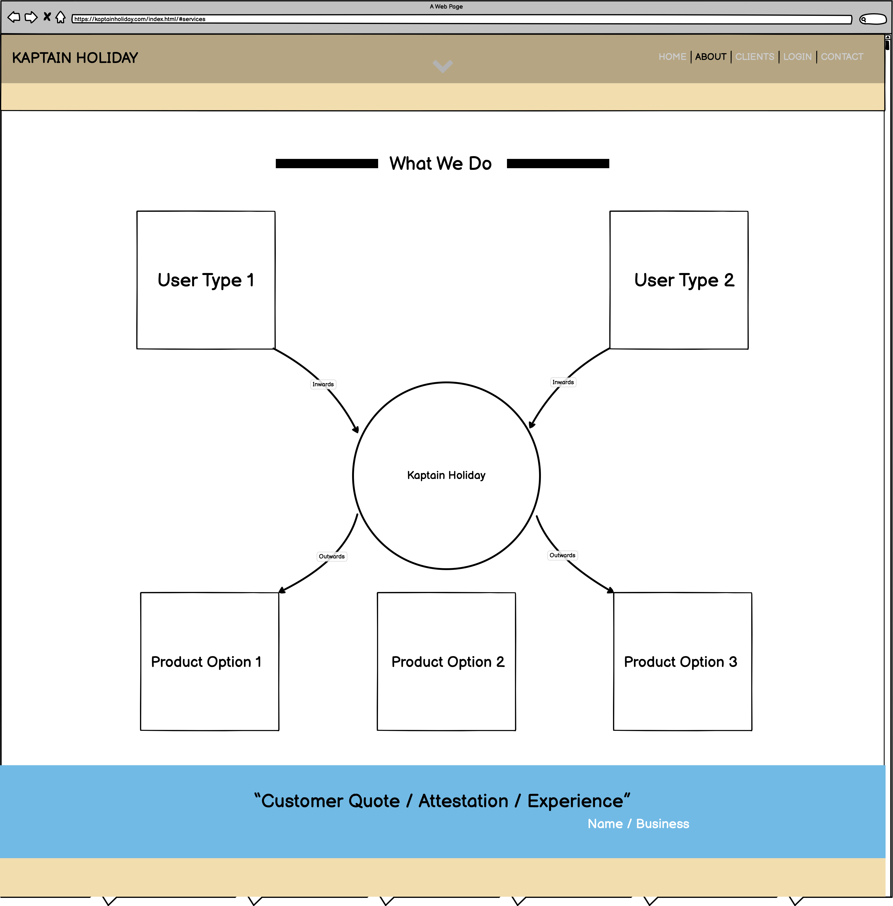

__Our Clients__
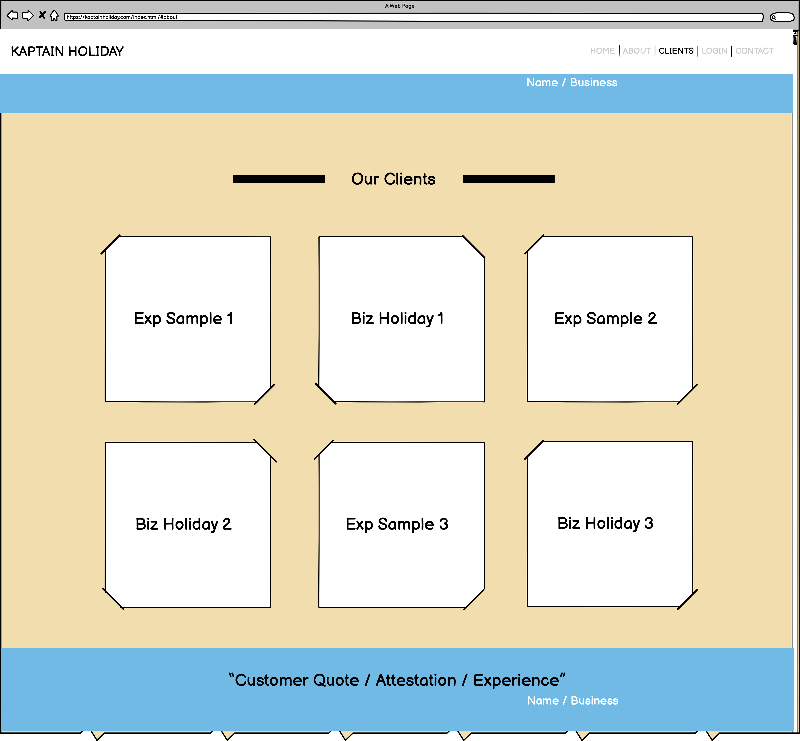

__Contact Us__
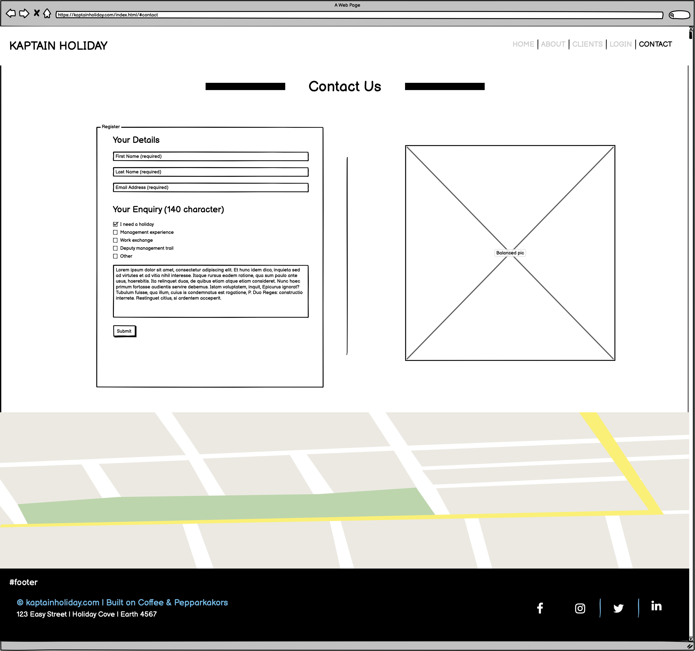

__Successful Submission__
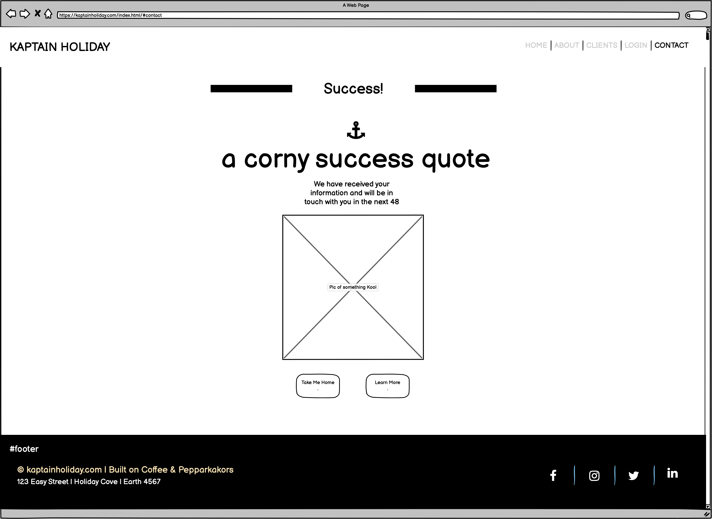

__Provider Stories__
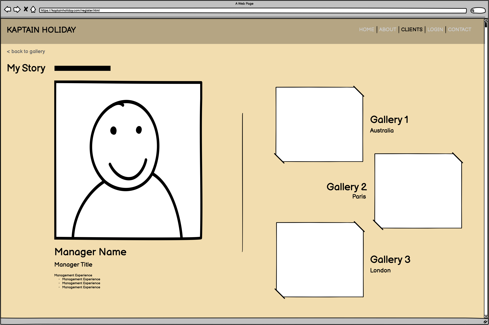

__Client Stories__
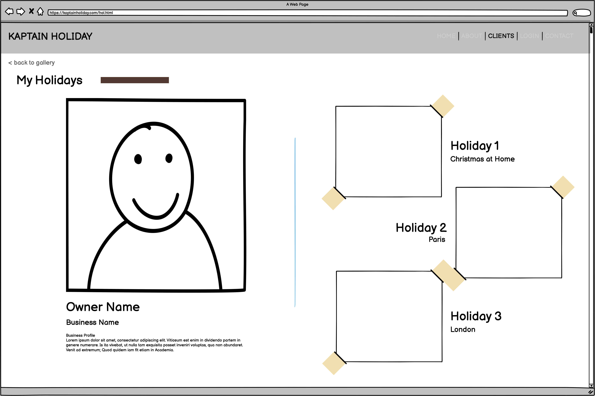

__Login / Register__
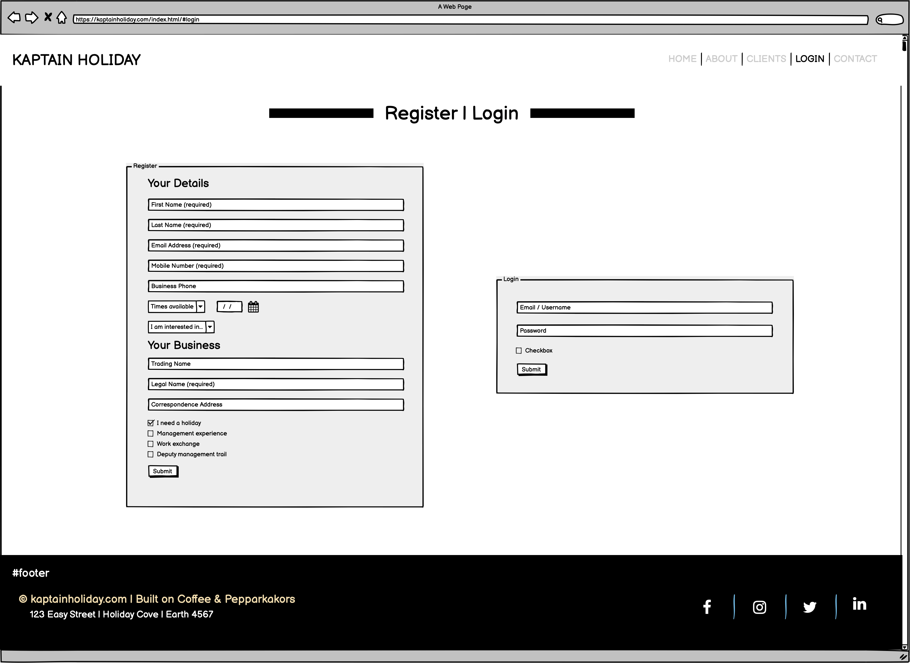

_Please see attached link to view the entire proposed early layout of the site in a .pdf format document at : [KH-wireframes.pdf](docs/images/KH_wireframes.pdf). The exchange process detailed in the KH-wireframes.pdf was reserved for future releases due to the scope of this as an initial project._

## 6. Technology

The skillsets used in the creation and review of this project are based around a working knowledge of HTML5 and CSS with thier associated semantic structures. 

The tools and the benefit of using each in the site development are : 
- GitHub
- GitPod
- Google Fonts
- Icon Generator
- HTML5 
- CSS
- Google Maps 
- Image Optimizers
- Font Awesome
- Balsamiq Wireframes
- Gimp GNU Image Manipulator
## 7. Testing

Overall I am satisfied that the included features all work as intended, employing HTML / CSS coding only. The project provides an easy and intuitive path for users to achieve their goals (Holiday cover / Management Assistance / Sales of Services).

- I have tested that this page works in different browsers: Chrome, Firefox, Safari, Edge.
- I confirmed that this project is responsive, looks good and functions on all standard screen sizes using the devtools device toolbar that accompanies the google chrome browser.
- I confirmed that the navigation, header, about us, sign up and contact text are all readable and easy to understand.
- I have confirmed that the form works: requires entries in every relevant field, will only accept email in the email field, and the submit button works.
- I have set each form ([contact](https://roeszler.github.io/kapthol/index.html#contact) and [login / register](https://roeszler.github.io/kapthol/login.html)) to method="get" to allow the interaction of each to return a positive response to the [success.html](https://roeszler.github.io/kapthol/success.html) page as indication of a successful submission. This is for testing purposes, and the final site would interact with a database / CRM messaging system in a live scenario.
- I have confirmed the navbar sticks to the top of the page with a 0.85 transparency that elicits content to be seen, however still allows the header text to be seen clearly.
- Animation of the header penguin to slightly enlarge and rotate to portray a sense of activity, with the palm tree to enlarge at a slightly slower rate for user interest and visual effect.
- White opaque overlay on mouse hover on images (and social links) that contain hyperlinks internal and external to the site. This has been included to create a subtle interactivity to the desktop user and promote links to further information or opportunity to connect with potential clients.
- Hover of form fields changing to slight blue border
- Centralized form sections on screen widths less than 1200 pixels
- Map section created that inherits and integrates appropriately with google maps

__Size / Responsivity Considerations__

The site functions with the primary light blue, sailor blue, white and black/gray interactions on subsequent elements. 

The mobile site has been designed to reduce the amount of information available and better direct the user to a message and/or contact us outcome. 

It has been designed to reflect that mobile users are mobile when accessing the site and in so, look to satisfying an immediate need, such as researching directions in a new city or looking up a phone number or an address. 

In contrast, people using a desktop (such as business users ready to commit) may be more likely to use the desktop format when they want to read several pages or conduct in-depth research.

## 8. Bugs
### Solved Bugs

Most problems seem to revolve around formatting and alignment of ```<div>``` sections with each other and centralizing content within them. Elements like ``` width:; padding:; margin:;``` have been used to align content, however some interaction between these (like when looking to adjust the screen ratios) has caused a few problems

1. Content alignment and the use of elements as detailed above.
2. About sections not lining up as desired with a single section. Included second section to correct issues.
3. Centralisation of [kapthol-hero-image-400.webp](assets/images/kapthol-hero-image-400.webp) to the central Kaptain Holiday text in the "what we do" section while changing screen sizes.
4. Image hover on the mobile section was influenced by the ```<div>``` containing the ```class="center-align-experience"``` class. It seemed to override the height of the entire content. Fixed with toggling the ```position:;``` element between the two in mobile width screen formats
5. Padding on the right side of ```class="input-forms"``` does not seem to be evenly spaced. Included ```padding-right: 45px;``` in the ```.input-forms``` css to adapt.
6. Fix gray styling to ```<hr>``` on experience.html and holiday.html
7. Remove unwanted border around hero image in about us section
8. Remove inline-block command conflict in the footer p styling
9. Alignment of footer section interrupted by height not equalling auto
10. Add appropriate ```index.html#id's``` to sections on each of the html pages
11. Correct about us alignment by including a separate section and change ```id=""``` references to ```class=""```.
12. Select element error in validation testing login.html needing a ```value=""``` to have content when using ```required``` feature. I would like to remove this in the future.
13. Semantic order of headings h1, h2 present an error in validation with a non-sequential order. Suggested to change the format of ```<section>``` to ```<div>```. It works, however to keep the semantic structure of the site, I have re-styled the h1, h2, h3 headings to display the formats we wish to see.

### Unsolved Bugs

Testing to the defined features and subsequent tests derived from user stories, currently produces no bugs. 
## 9. Validator Testing 

- HTML
  - index.html = No errors were returned when passing through the official W3C validator on each of the following pages :
    - [index.html](https://validator.w3.org/nu/?doc=https%3A%2F%2Froeszler.github.io%2Fkapthol%2Findex.html)
    - [success.html](https://validator.w3.org/nu/?doc=https%3A%2F%2Froeszler.github.io%2Fkapthol%2Fsuccess.html)
    - [login.html](https://validator.w3.org/nu/?doc=https%3A%2F%2Froeszler.github.io%2Fkapthol%2Flogin.html)
    - [holiday.html](https://validator.w3.org/nu/?doc=https%3A%2F%2Froeszler.github.io%2Fkapthol%2Fholiday.html)
    - [gallery.html](https://validator.w3.org/nu/?doc=https%3A%2F%2Froeszler.github.io%2Fkapthol%2Fgallery.html)
    - [experience.html](https://validator.w3.org/nu/?doc=https%3A%2F%2Froeszler.github.io%2Fkapthol%2Fexperience.html)

- CSS
  - No errors were found when passing through the official [Jigsaw CSS validator](https://jigsaw.w3.org/css-validator/validator?uri=https%3A%2F%2Froeszler.github.io%2Fkapthol%2Findex.html&profile=css3svg&usermedium=all&warning=1&vextwarning=&lang=en)

- Accessibility
  - I confirmed that the colors, contrast and fonts chosen are easy to read and accessible by running it through [lighthouse](https://developers.google.com/web/tools/lighthouse/) in dev tools.
  
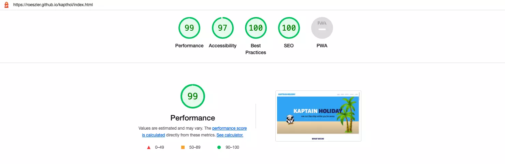


## Deployment

### Display Environment
The site has been deployed to GitHub pages. The steps to deploy are as follows: 
  - Create / open an exsisting repository for the project with the name of your choice on your GitHub, GitLab or Bitbucket account page
  - Navigate within the GitHub repository you chose, and then navigate to the "settings" tab, which displays the general title.
  - On the left hand navigation menu, I selected the "pages" option midway down the menu.
  - At the top of the pages tab, the source section drop-down menu changed to select the branch: "main" with the folder selected as "/(root)"
  - Committed to the save and waited a few moments for the settings to coordinate with the server. 
  - On refresh of the browser, the dedicated ribbon changed to the selected web address, indicating a successful deployment.

> The live link can be found at - https://roeszler.github.io/kapthol/index.html

### Development Environment
The site has been deployed to GitPod pages. The steps to deploy are as follows:
- In the GitHub, GitLab or Bitbucket account page where you created a repository for the project, when on the tab titled '<> Code', navigate to the button on the top right of the repositiry navigation pane titled 'Gitpod'.
- If you press this it will create a new GitPod devlopment environment each time.

__Alternatively, if you have already created the GitPod environment for your project__ : 

- In the browser’s address bar, prefix the entire URL with [gitpod.io/#](https://gitpod.io/#) or [gitpod.io/workspaces](https://gitpod.io/workspaces) and press Enter. This will take you to a list of workspaces that have been active within the past 14 days.
- Search for the workspace you wish to work on and access the link to it that lies within the https://gitpod.io/... pathway
  - NOTE: the difference between GitPod hyperlink and the GitHub hyperlink. For example: 
    - the GitPod workspace for this site is https://gitpod.io/start/#roeszler-kapthol-y3gyoqrxrk4
    - the GitHub repository for this site is https://github.com/roeszler/kapthol


For example, gitpod.io/#https://github.com/gitpod-io/website
We recommend you install the Gitpod browser extension to make this a one-click operation.
Sign in with one of the listed providers and let the workspace start up.
## Credits 

### Content 

- Primary and additional CSS and html coding was studied and reworked from modules provided through the Code Institute's [Diploma in Full Stack Software Devlopment](https://codeinstitute.net/se/full-stack-software-development-diploma/), [W3 Schools](https://www.w3schools.com/), [Stack overflow](https://stackoverflow.com/), [mozilla.org](https://developer.mozilla.org/en-US/docs/Web/CSS/background) and [GeeksforGeeks](https://www.geeksforgeeks.org/). These included research and implementation of: 
  - position: sticky;
  - z-index: ;
  - opacity: ;
  - text-shadow: ;
  - background-image: linear-gradient();
  - embed a map in iframes using [google cloud console](https://developers.google.com/maps/documentation/embed/cloud-setup)

- The screen size for mockups and responsiveness testing was sampled from [GBK Soft](https://gbksoft.com/blog/common-screen-sizes-for-responsive-web-design/) and based current resolutions typically found in the UK marketplace
- Country codes for dropdown list in contact us section - [html-code-generator.com](https://www.html-code-generator.com/html/drop-down/country-names)

- The text for the Home page was sourced from [Alegreya Sans](https://fonts.google.com/specimen/Alegreya+Sans) by Juan Pablo del Peral, Huerta Tipográfica and [Nunito](https://fonts.google.com/specimen/Nunito) by Vernon Adams, Cyreal, Jacques Le Bailly imported via google fonts. 
- Instructions on how to implement form validation on the Sign Up page was taken from [Specific YouTube Tutorial](https://www.youtube.com/)
- The icons in the footer were taken from [Font Awesome](https://fontawesome.com/)

### Media

- The photos, videos and vector graphics used on the home and sign up page are from [pixbay.com](https://pixabay.com/users/openclipart-vectors-30363/), upsplash and [freepik.com](https://www.freepik.com/home)
  - all penguin images - sourced from Pixbay user [OpenClipart-Vectors](https://pixabay.com/vectors/tux-anchor-animal-bird-boat-ferry-161379/).
  - palmtree.webp - sourced from [Palm tree icon vector created by brgfx - www.freepik.com](https://www.freepik.com/vectors/palm-tree-icon)
  - contact-us.webp - sourced from [unsplash.com](https://unsplash.com/photos/4SNUcHPiC8c)
  - success.webp - sourced from [pixabay.com](https://pixabay.com/photos/children-win-success-video-game-593313/)
  - sally-provider.webp - sourced from [unsplash.com](https://unsplash.com/s/photos/owner)
  - all bus images were sourced from pexels user [@nubikini](https://www.pexels.com/@nubikini)
  - Video by [Jess Loiterton](https://www.pexels.com/video/sea-waves-kissing-the-beach-shore-4782135/) from Pexels

- The images used for the gallery page were taken from a pexels.com collection curated [here](https://www.pexels.com/collections/kapthol-wqxkprh/) and [here](https://www.pexels.com/search/cafe/).

---

 *__Please Note__ : Kaptain Holiday is a fictitious site used entirely for educational purposes at the time of coding. Notwithstanding its theoretical nature, it has been written as a proof of concept and invitation to treat for possible interested investors into the future. All copyright for ideas, concepts and materials lies with Stuart Roeszler © 2022.*


