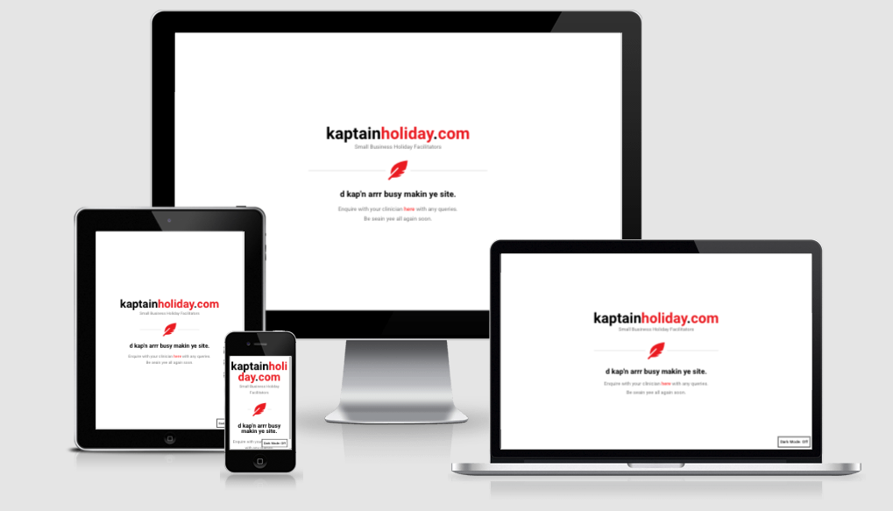

# Kaptain Holiday
### HTML and CSS Essentials Portfolio Project 1
Site link : https://roeszler.github.io/kapthol/index.html

<!-- 
~~1. Purpose of the project~~
~~2. user stories~~
~~3. Features
~~4. future features
  - popouts
  - header bar 
  - login / registration page
  - animations
~~5. Typography and color scheme
6. Wireframes
7. Technology
8. testing
   8.1 code validation
   8.2 test cases (user story based with screenshots)
   8.3 fixed bugs
   8.4 supported screens and browsers
9. Deployment
   9.1 via gitpod
   9.2 via github pages
10. credits 
-->

## 1. Purpose of the Project
---
Kaptain Holiday is a site that represents a 'currently' fictitious business that facilitates holidays for small to medium businesses. The site is targeted at three main users looking to employ/provide services that allow them to take a break from the daily operations of their small business.

- __Business owner / managers__ looking for someone to take over the daily operations of their business for a short time (_The 'Clients'_).

- __Business professionals__ with appropriate training, responsibility and availability to care-take operations within a small to medium business for a contract period of time (_The 'Providers'_).

- __Business Students__ looking to gain small business management experience in an assistant manager role for a short period of time, across a variety of industries and global locations (_The 'Assistants'_).

Based out of Stockholm, Sweden, __Kaptain Holiday__ will be useful for those looking for work flexibility, experiences, travel and/or seeking to build a relationship with a team that are able to comfortably coordinate their business operations while they take a break in the future.

### Main Products / Services

| 3 x Primary Services | | 3 x Working Formats |
| - |:-:| -:|
| 1. Holday Cover | | Assistant to Manager (testing) .A|
| 2. Management Experience | | Proxy Manager (holidays) .B|
| 3. Service Trial | | Management Exchange (business swaps) .C|

## 2. User Stories
---
### Content
__Entire Site__
- As a site user I can see that all pages are responsive to different devices being used so I can have a responsive experience across devices used to view it.
- As a viewer of the code I can see that each .html page uses a remotely accessed CSS format so I can confirm this section follows approriate ease of styling and semantic code structuring practices.
- As a site user I can see that every non-text element has alt text so that the website can meet accessibility guidelines.

- Header
  - As a viewer of code: 
    - I can see the index.html page has a < header > element with corresponding id="header"
    - I can see an image within the header element with a corresponding id="header-img"
    - I can see that within the < header > element there is a < nav > element with corresponding id="nav-bar"
  - So that code viewers can confirm this section follows approriate semantic code structuring practices.
  - As a site user I can see the layout of the < header > element is always at the top of the viewport so that navigation is easy and intuitive.

- Home Button / Icon
  - As a site user I can easily identify with the style of the home button so I can intutively navigate the sections and pages of the site.

- Nav Bar
  - As a site user I can click a .nav-link button in the nav bar so that I am taken to the corresponding section of the index.html page.

__Home Page__

- Hero Text
  - As a site user I can see that the hero text on the #home section is clearly presented, appropriately colored and contrasted so that the site is introduced intuitively in an easy to read manner.

- Hero Image
  - As a site user I can identify with the hero image to relate to the core services of the business so that business value proposition can be re-inforced during my time navigating the site.

- Layout
  - As an intitial site user I can see the top of the subsequent page bleed ing up ath the bottom of the page so that I am enticed to investigate into the site further.

__Gallery (Our Clients)__
- As a user of the site I can view the experiences of past clients of the business so i can better understand the experience of using these services.
- As a potential customer of the business I can further investigate the experience of other customers so I can decide if it will work with my situation and needs.
- As a business stakeholder I can present more detailed information to potential clients so I can convert them into long term paying customers.

__Contact Us__
- Form
  - As a viewer of the code I can see that the index.html page has a < form > element with a corresponding id="form" so I can confirm this section follows approriate semantic code structuring practices.
  - As a viewer of the code I can see that within the form, there is an < input > field with id="email" so I can enter an email address.
  - As a viewer of the code I can see that the #email input field should have a label or placeholder text so that the user knows what the field is for.
  - As a viewer of the code I can see that #email input field uses HTML5 validation so thst we can confirm that the entered text is an email address.
  - As a viewer of the code I can see that within the form, there is a submit < input > with corresponding id="submit" to allow ease of CSS styling in the future.
  - As a site user I can click the #submit button so that the email is submitted to a static thanyou for submission page (success.html) that confirms the email address was entered (and that it posted successfully).

- Map 
  - As a site user I can see an embedded google map of our head office at the immedia end of the contact us section to convey a sense of permanacy in the business operations.

- Footer
  - As a site user I can see a footer section containing links to our pages popular social media sites so I can inteact with friends and follow updates from the business page. 

## 3. Features 
---
<!-- This section explains what value each of the features provides for the user,
  - Focusing on who this website is for, 
  - what it is that they want to achieve and 
  - how your project is the best way to help them achieve these things. 
 -->

### 3.1 Existing Features

- __Head & Meta Terms__
  - Nomenclature
    - Discussed further in the [strategy.md](ucd/1-strategy.md) documentation, Kaptain Holiday name was selected for its memorable nature, sense of playfulness and meaningful connection to the core value proposition of the business.
    - Key Terms : kaptain, holiday, holidays, captain holiday, management, proxy, stand-in, locum, business holiday, sweden, stockholm, facilitator, small business management.

  - Branding
    - The themes and branding associated with Kaptain Holiday is aimed at associating a  - light, happy, sunnny, cloud free, blue skies, impact, fun - non-corporate nature of business owner / managers.
    - Services and soultions aim to be subtly associated with a "day at the beach" or "a sunny holiday with a pool". 
    - The demographic is aimed at the mid twenties (providers / assistants) to late fourties (clients) age groups. 
    
     

    | Primary Color Palette | Hexadecimal Value | RGBA Value  |
    | - |:-:| -:|
    | Sky Blue | #70BBE7 | rgba (112,187,231,1) |
    | Light Tan | #F2DDB2 | rgba (242,221,178,1) |
    | Choc Brown | #52382C | rgba (82,56,44,1) |
    | White | #FFFFFF | rgba (82,56,44,1) |
    | Black | #000000 | rgba (253,253,253,1) |
    | Grey | #CCCCCC | rgba (204,204,204,1) |

  - Content
    - each .html page uses a remotely accessed CSS format so that code editors can more easily change the format of content from the one location

  - Layout 
    - All pages should have at least one media query to make the viewport responsive to different devices being used so that users can have a responsive experience across devices used to view the entire site.

- __Navigation Bar__

  - Is featured identically on all pages in the top right hand coner with a minimal design to create a clean simple style and allow easy intuitive navigation. 
  - The full responsive navigation bar includes links to the home page, our services, customer stories, login / registration and contact us pages to allow easy intuitive navigation.
  - The site is designed to be browsed easily as a single page site with additional 'deeper' pages used to delve into more detail as reqiured by the B2B user.
  - The navigation bar allows the user to easily navigate from page to page across all devices without having to revert back to the previous page via the ‘back’ button.

- __The landing page image__

  - The landing section includes a format and images with text overlay to allow the user to understand what type of user this site would be applicable to.
  - The landing section announces the core business proposition with a subtle animation to grab the users attention.

- __The Header__

  - The header shows the name of the business, using the corporate colors selected from the corporate colour scheme discussed further in the [strategy.md](ucd/1-strategy.md) documents attached.

- __About Us Section__

  - Allow the user to see the typical process of the Kaptain Holiday product delivery in a vsiual format to better understand the services of the business.
  - Allow the user to see the value of kaptain holiday to allow them to take a break. 
  - Allow the user their first chance to select / investigte wich product option that may suit their particular circumstances.
  - Allow users to intiate a contact us call to action so they may start using kaptain holiday services. 

- __Gallery (our clients) section__

  - This section will allow the user to further explore the product range and experinces of model customers. It should encourage users to consider Kaptain holiday as part of their next break away from the business. 
  - This section will be kept up to date as times and new intitiatives become available to keep the user engaged with the business. 

- __The Contact Us Section__

  - This section will allow the user to contact us with queries and schedule suitable times for a callback 
  - The user will be able to specify if they would like to take part in hiring a manager, manager exchange exchange programs, or applying to becoming a manager with us. 
  - The user will be asked to submit their full name, email address, contact phone number, business name, date and times available to schedule a call, level of experience, linkedin details and a short enquiry message via a text field. 

- __The Footer__ 

  - The footer section includes links to the relevant social media sites for Kaptain Holiday. The links will open to a new tab to allow easy navigation for the user. 
  - The footer section includes information for the user on the legal format and registered office address of the Kaptain Holiday business. 
  - The footer is valuable to the user as it encourages them to keep connected via social media and share with people / businesses they may know that may use the kaptain holiday service(s).

### Subsequent HTML Pages

- __ABC / Gallery / User Case Studies Page__

  - This page will be the base format of three main product options provided by Kaptain Holiday to allow the user to easily investigate exactly which option is valuable to their situation. 
  - This page provides the user with supporting images and information to see what types of professionals are avialiable to manage their business while they are away. 
  - These pages are valuable to the user as they will be able to relate to the requirements and types of businesses and professionals that Kaptain Holiday typically helps.

- __The Register / Login Page__

  - This page will allow the user to either login or sign up to Kaptain Holiday to start planning their next holiday within the community. 
  - The user will be able to specify if they would like to take part in hiring a manager, manager exchange exchange programs, or applying to becoming a manager with us. 
  - The user will be asked to submit their full name, email address and linkedin details. 

- __Successful Submission Page__

  - This page indicates is displayed to the user following a successful enquiry submission and indicates a call to action to refer friends via social media, investigate further products and/or return to the site homepage. 
  - The user will be able to specify if they would like to take part in a short survey following submission for the chance to win a sassion with a business mentor. 

<!-- _For some/all of your features, you may choose to reference the specific project files that implement them._

_In addition, you may also use this section to discuss plans for additional features to be implemented in the future:_ -->

### 3.2 Future Features

  - Account page for logged-in users
  - Popup Q&A animations 
  - Entry animation and smoothing
  - Option to select work / hire an assistant manager role to train and trial full services
  - Integration with nationally based small-business education entities
  - Automation to connect current registered [clients](ucd/1-strategy.md) and [providers](ucd/1-strategy.md)
  - Possible membership on a subscription model basis
  - api links into CRM and project management software (like [jira](https://www.atlassian.com/software/jira), [trello](https://trello.com/), [hubspot](https://www.hubspot.com/) and/or [slack](https://slack.com/))
   
## 5. Typography and color scheme
---
- Typography
    - Evaluated in line with the themes and brand aiming for a the non-corporate nature of business owner / managers.
    - Bold main 
    - Smooth easy to read content 
    - Excellent contrast 
    - Adequately portray the light, summer holiday feel for the site
    - Slection process :
      - .
    
     
- Color Scheme
    | Primary Color Palette | Hexadecimal Value | RGBA Value  |
    | - |:-:| -:|
    | Sky Blue | #70BBE7 | rgba (112,187,231,1) |
    | Light Tan | #F2DDB2 | rgba (242,221,178,1) |
    | Choc Brown | #52382C | rgba (82,56,44,1) |
    | White | #FFFFFF | rgba (82,56,44,1) |
    | Black | #000000 | rgba (253,253,253,1) |
    | Grey | #CCCCCC | rgba (204,204,204,1) |

## 6. Wireframes
--- 

_See attached link to view the entire proposed early layout of the site in a .pdf format document at : [KH_wireframes.pdf](assets/docs/KH_wireframes.pdf)._

__The Landing Section__ 
- .

__What We Do (About Us)__
- .

__Our Clients__
- .

__Contact Us__
- .

__Successful Submission__
- .

__Provdier Stories__
- .

__Client Stories__
- .

__Echange Process__
- .

__Login / Register__
- .

## 7. Technology
--- 

## 8. Testing 
---
- I have tested that this page works in different browsers: Chrome, Firefox, Safari, Edge.
- I confirmed that this project is responsive, looks good and functions on all standard screen sizes using the devtools device toolbar that accompanies the google chrome browser.
- I confirmed that the navigation, header, about us, sign up and contact text are all readable and easy to understand.
- I have confirmed that the form works: requires entries in every relevant field, will only accept email in the email field, and the submit button works.

_In this section, you need to convince the assessor that you have conducted enough testing to legitimately believe that the site works well. Essentially, in this part you will want to go over all of your project’s features and ensure that they all work as intended, with the project providing an easy and straightforward way for the users to achieve their goals._

_In addition, you should mention in this section how your project looks and works on different browsers and screen sizes._

_You should also mention in this section any interesting bugs or problems you discovered during your testing, even if you haven't addressed them yet._

_If this section grows too long, you may want to split it off into a separate file and link to it from here._

### Bugs 
#### Solved Bugs
- A
- B

#### Unsolved Bugs

- No unsolved bugs

### Validator Testing 

- HTML
  - No errors were returned when passing through the official [W3C validator](https://validator.w3.org/nu/?doc=https%3A%2F%2Froeszler.github.io%2Flove-running%2Findex.html)
- CSS
  - No errors were found when passing through the official [Jigsaw CSS validator](https://jigsaw.w3.org/css-validator/validator?uri=https%3A%2F%2Froeszler.github.io%2Flove-running%2Findex.html&profile=css3svg&usermedium=all&warning=1&vextwarning=&lang=en)
- Accessibility
  - I confirmed that the colors and fonts chosen are easy to read and accessible by running it through [lighthouse](https://developers.google.com/web/tools/lighthouse/) in dev tools.
  

## Deployment
---
This section should describe the process you went through to deploy the project to a hosting platform (e.g. GitHub) 

- The site was deployed to GitHub pages. The steps to deploy are as follows: 
  - In the GitHub repository, navigate to the Settings tab 
  - From the source section drop-down menu, select the Master Branch
  - Once the master branch has been selected, the page will be automatically refreshed with a detailed ribbon display to indicate the successful deployment.

> The live link can be found here - https://roeszler.github.io/kapthol/index.html

## Credits 
---
In this section you need to reference where you got your content, media and extra help from. It is common practice to use code from other repositories and tutorials, however, it is important to be very specific about these sources to avoid plagiarism. 

You can break the credits section up into Content and Media, depending on what you have included in your project. 

### Content 

- The screen size for mockups and responsiveness testing was sampled from [GBK Soft](https://gbksoft.com/blog/common-screen-sizes-for-responsive-web-design/) and based current resolutions typically found in the UK marketplace
- 
- The text for the Home page was taken from Wikipedia Article A
- Instructions on how to implement form validation on the Sign Up page was taken from [Specific YouTube Tutorial](https://www.youtube.com/)
- The icons in the footer were taken from [Font Awesome](https://fontawesome.com/)

### Media

- The photos used on the home and sign up page are from *This Open Source site*
- The images used for the gallery page were taken from this other open source site

Congratulations on completing your Readme, you have made another big stride in the direction of being a developer! 

## Other General Project Advice
---
Below you will find a couple of extra tips that may be helpful when completing your project. Remember that each of these projects will become part of your final portfolio so it’s important to allow enough time to showcase your best work! 

- One of the most basic elements of keeping a healthy commit history is with the commit message. When getting started with your project, read through [this article](https://chris.beams.io/posts/git-commit/) by Chris Beams on How to Write  a Git Commit Message 
  - Make sure to keep the messages in the imperative mood 

- When naming the files in your project directory, make sure to consider meaningful naming of files, point to specific names and sections of content.
  - For example, instead of naming an image used ‘image1.png’ consider naming it ‘landing_page_img.png’. This will ensure that there are clear file paths kept. 

- Do some extra research on good and bad coding practices, there are a handful of useful articles to read, consider reviewing the following list when getting started:
  - [Writing Your Best Code](https://learn.shayhowe.com/html-css/writing-your-best-code/)
  - [HTML & CSS Coding Best Practices](https://medium.com/@inceptiondj.info/html-css-coding-best-practice-fadb9870a00f)
  - [Google HTML/CSS Style Guide](https://google.github.io/styleguide/htmlcssguide.html#General)

Getting started with your Portfolio Projects can be daunting, planning your project can make it a lot easier to tackle, take small steps to reach the final outcome and enjoy the process! 

 *__Please Note__ : Kaptain Holiday is a fictitious site at the time of coding. Notwithstanding its theoretical nature, it has been written as a proof of concept and invitation to treat for possible interested investors into the future. All copyright for ideas, concepts and materials lies with Stuart Roeszler © 2022.*

